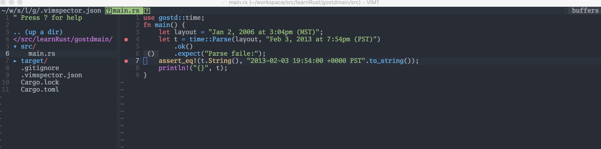
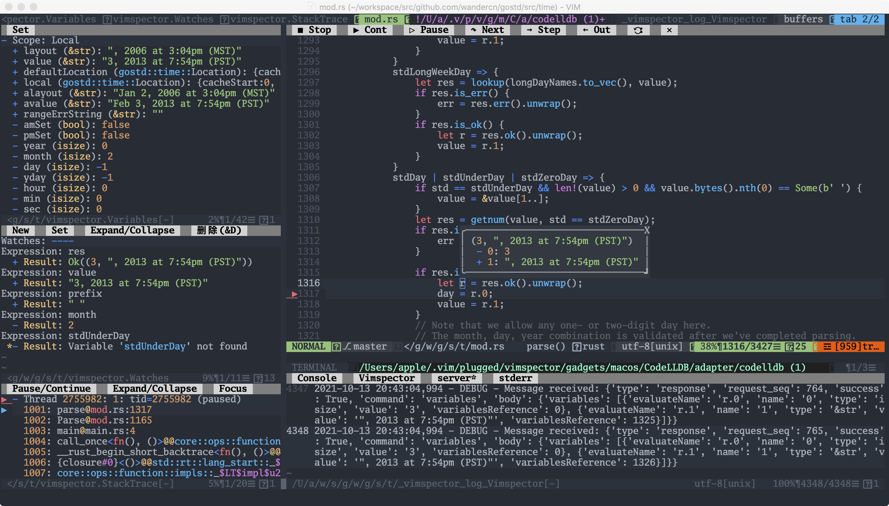
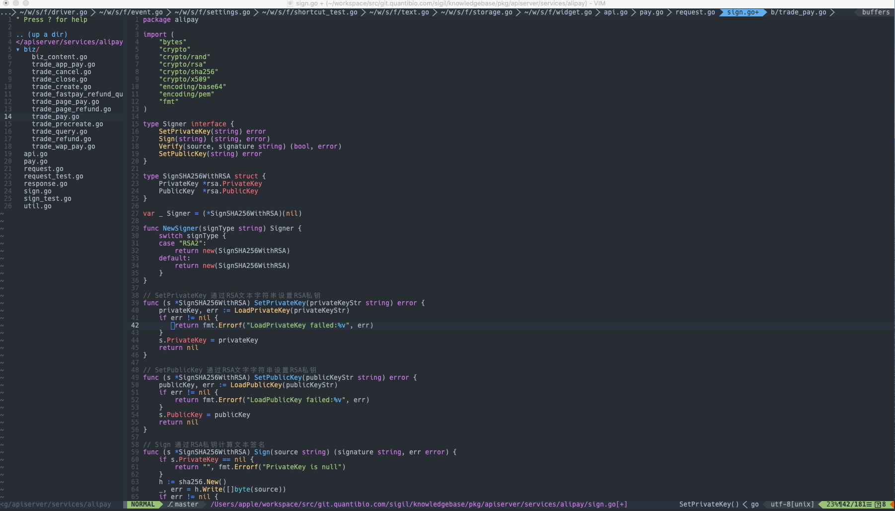
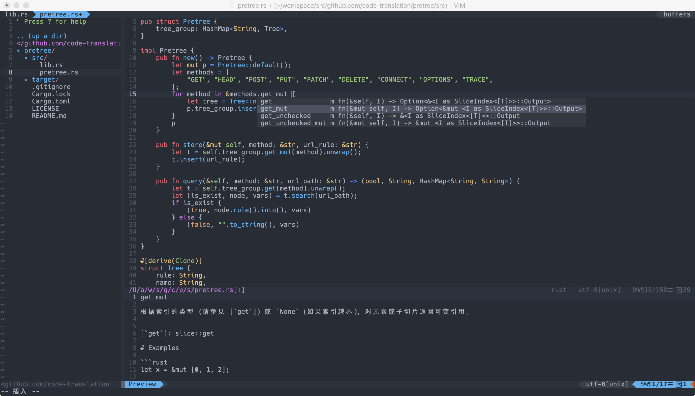
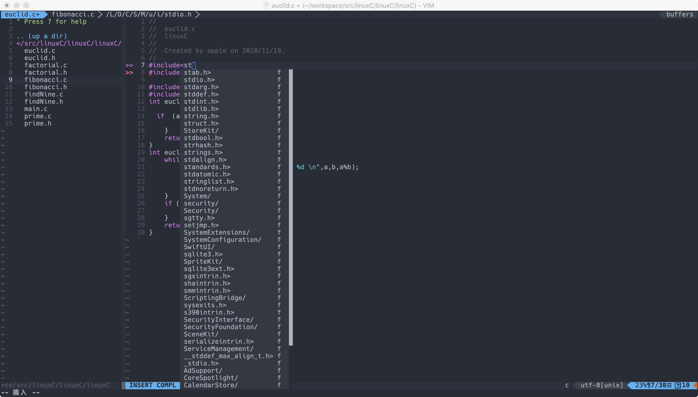
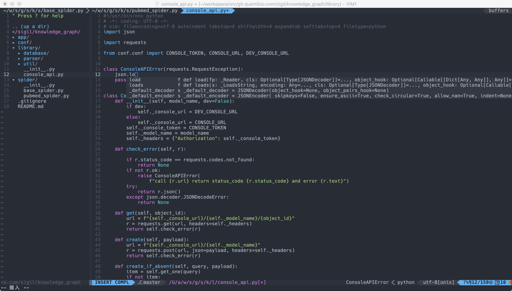
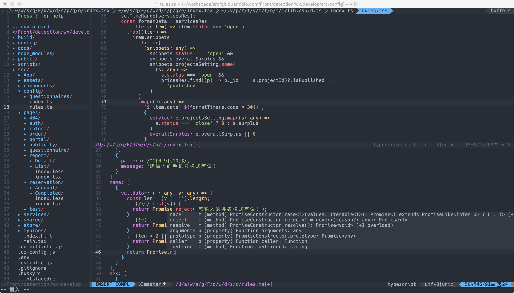
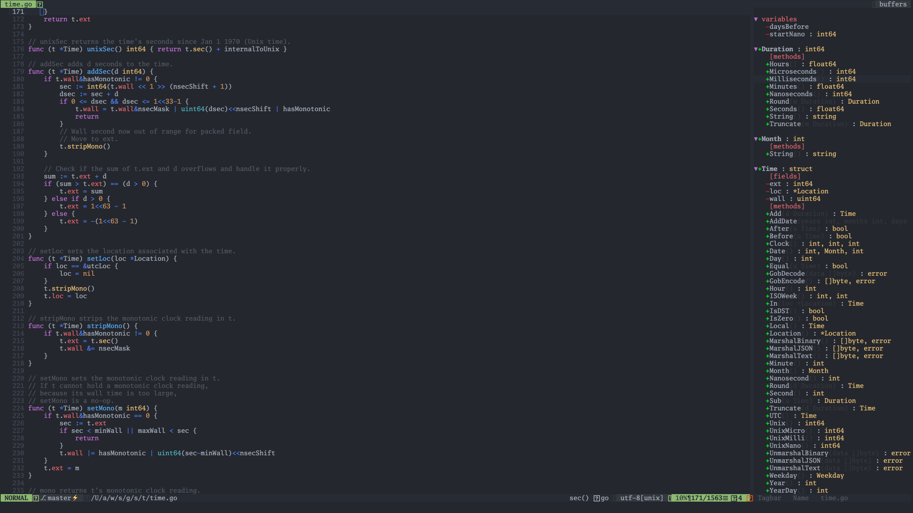
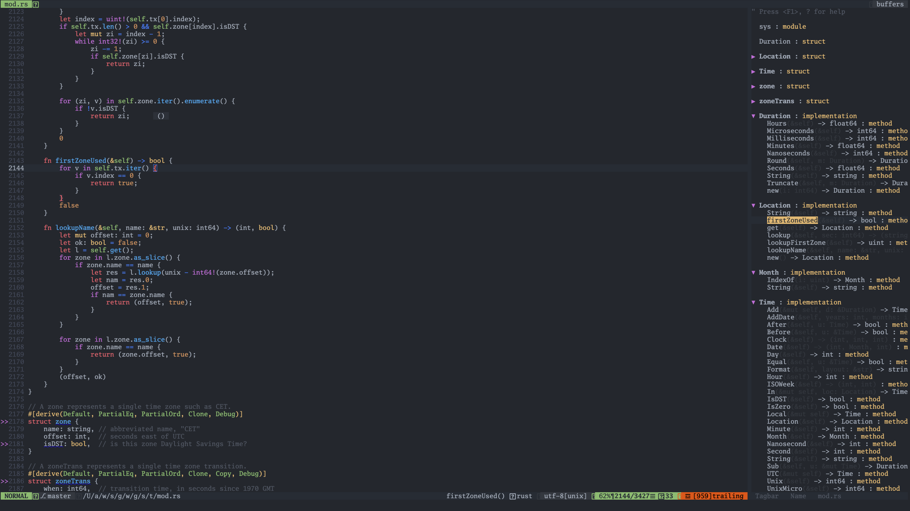

# go-ide-vim.conf
my vim conf for golang IDE and rust IDE

## supported languages

- [x] Golang
- [x] Rust
- [x] C
- [x] Python
- [x] Java 
- [x] JavaScript
- [x] TypeScript

## requirements

 vim 8.0 +python3 +lua
 
 iTerm2 (Support true color) 

    brew install macvim
```
     vim --version
VIM - Vi IMproved 8.2 (2019 Dec 12, compiled Apr 01 2021 08:32:44)
macOS version - x86_64
包含补丁: 1-2681
编译者 Homebrew
巨型版本 带 MacVim 图形界面。  可使用(+)与不可使用(-)的功能:
+acl               +file_in_path      -mouse_sysmouse    -tag_old_static
+arabic            +find_in_path      +mouse_urxvt       -tag_any_white
+autocmd           +float             +mouse_xterm       +tcl
+autochdir         +folding           +multi_byte        +termguicolors
-autoservername    -footer            +multi_lang        +terminal
+balloon_eval      +fork()            -mzscheme          +terminfo
+balloon_eval_term +fullscreen        +netbeans_intg     +termresponse
+browse            +gettext           +num64             +textobjects
++builtin_terms    -hangul_input      +odbeditor         +textprop
+byte_offset       +iconv             +packages          +timers
+channel           +insert_expand     +path_extra        +title
+cindent           +ipv6              +perl              +toolbar
+clientserver      +job               +persistent_undo   +transparency
+clipboard         +jumplist          +popupwin          +user_commands
+cmdline_compl     +keymap            +postscript        +vartabs
+cmdline_hist      +lambda            +printer           +vertsplit
+cmdline_info      +langmap           +profile           +virtualedit
+comments          +libcall           -python            +visual
+conceal           +linebreak         +python3           +visualextra
+cryptv            +lispindent        +quickfix          +viminfo
+cscope            +listcmds          +reltime           +vreplace
+cursorbind        +localmap          +rightleft         +wildignore
+cursorshape       +lua               +ruby              +wildmenu
+dialog_con_gui    +menu              +scrollbind        +windows
+diff              +mksession         +signs             +writebackup
+digraphs          +modify_fname      +smartindent       -X11
+dnd               +mouse             -sound             -xfontset
-ebcdic            +mouseshape        +spell             +xim
+emacs_tags        +mouse_dec         +startuptime       -xpm
+eval              -mouse_gpm         +statusline        -xsmp
+ex_extra          -mouse_jsbterm     -sun_workshop      -xterm_clipboard
+extra_search      +mouse_netterm     +syntax            -xterm_save
-farsi             +mouse_sgr         +tag_binary       
```

Plugin Manager

```
curl -fLo ~/.vim/autoload/plug.vim --create-dirs \
    https://raw.githubusercontent.com/junegunn/vim-plug/master/plug.vim

```

## install

    git clone https://github.com/wandercn/go-ide-vim.conf.git ./vim_conf && mv ./vim_conf/.vimrc $HOME/.vimrc

    vim +PlugInstall

## install YouCompleteMe
```
cd ~/.vim/plugged/YouCompleteMe/
./install.py --all

```
YouCompleteMe 如果编译安装不成功，不想折腾的，可以考虑用coc.nvim做代码补全。快捷键基本一样，vimrc配置在 [rust-ide-with-coc](https://github.com/wandercn/rust-ide-with-coc)
## Shortcut key description
| 快捷键 | 功能说明 |en-us description  |对应编程语言 |
| :-----| :---- | :---- | :---- |
| gr    | 查看引用列表|GoToReferences|any|
| [Control] + n    |浏览引用列表，查看下一个|view references list, next one|any|
| [Control] + m    |浏览引用列表，查看上一个|view references list, previou one|any|
| ca    |关闭引用列表|close references list, previou one|any|
| gd    | 查看定义|GoToDefinition|any|
| gi    | 查看接口类型实现|GoToImplementation| any|
| rn    | 标识符重命名|RefactorRename | any |
| [Space] + b  | 编译代码| Build Code | Rust,Go |
| [Space] + r  | 运行代码| Run Code | Rust,Go |
| [Space] + t  | 运行测试| Run Test Code|Rust,Go|
| tg         | 打开/关闭TagBar查看器| open/close TagBar Viewer|any|
| [Control] + z | 打开/关闭NeoTree浏览器| open/close NeoTree|any|
| [Control] + o | 回退光标到上一次所在文件位置| Rewind the cursor to the last file location|any|
| [Control] + p | 打开快速文件搜索.|Open a quick file search|any|
| :noh | 关闭搜索匹配的文字高亮效果.| Turn off the text highlighting effect for search matches|any|
| :MarkdownPreview  | 打开MarkDown文档实时预览,会在浏览器打开页面。|Open MarkDown documents for live preview|MarkDown|
| [Shift] + p + m | 打开vim内部MarkDown预览窗口|Open the vim internal MarkDown preview window|MarkDown|
| [F9]           |设置调试断点 |set breakpoint |Rust,Go|
| [F5]            | 启动图形化调试 |start graphical debugger |Rust,Go|
| [Space] + c + c           |注释单行代码 |Comment one line of code|any|
| [Space] + c + m           |注释多行代码 |Comment multiline code|any|
| [Space] + c + u           |取消注释代码 |Uncomment code|any|

## FAQ

1. let g:rustfmt_autosave =1 开启保存很慢超过3秒钟,怎么处理？
> set foldmethod =syntax "基于语法进行代码折叠 ,这个设置引起的。改成 set foldmethod = indent 或者manual就能解决问题。
## Debug Code

图形化Debug代码

### 怎么debug rust ？

#### 插件准备

在Vim中用命令 `:VimspectorInstall CodeLLDB` 安装必要插件,[Vimspector官方说明](https://github.com/puremourning/vimspector#rust)

1. 新建配置文件

需要在每个项目目录下创建独立的`.vimspector.json`。

Rust项目配置内容参考如下，`gostdmain` 项目名称需要根据实际修改。
```
{
  "configurations": {
    "launch": {
      "adapter": "CodeLLDB",
      "configuration": {
        "request": "launch",
        "program": "${workspaceRoot}/target/debug/gostdmain"
      }
    }
  }
}
```

2. 设置断点

在代码需要调试行，按键盘功能键F9设置断点显示为红点，如下图:


3. 启动调试

按键盘功能键F5, 启动图形化调试界面，如下图:

其他步骤点击界面显示的按钮就可以了，比敲命令调试方便高效多了。


###  怎么debug go ？

#### 插件准备
在Vim中用命令 `:VimspectorInstall vscode-go` 安装必要插件,[Vimspector官方说明](https://github.com/puremourning/vimspector#go)

Delve installed, e.g. go get -u github.com/go-delve/delve/cmd/dlv

1. 新建配置文件

Go虽然用dlv命令调试也算比较方便的，但是图形化调试还是更高效点。

其他步骤与debug rust一样。

区别就一点，debug配置文件内容不一样。在go项目目录下创建`.vimspector.json`。

Go项目配置内容参考如下, `dlvToolPath`对应的值就是你dlv工具的安装位置。
```
{
  "configurations": {
    "run": {
      "adapter": "vscode-go",
      "configuration": {
        "request": "launch",
        "program": "${fileDirname}",
        "mode": "debug",
        "dlvToolPath": "$HOME/go/bin/dlv"
      }
    }
  }
}

```

## screen

### Go


### Rust 


### C


### Python 

### Java 

### JavaScript and TypeScript 


## tagbar

### TagBar for Go


### TagBar for Rust



